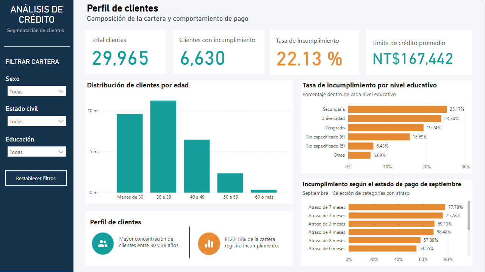
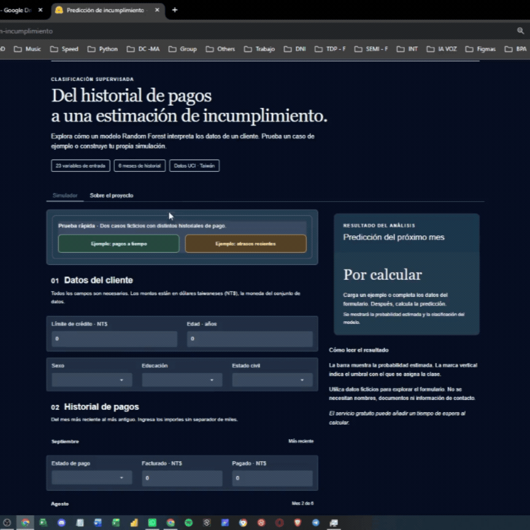

# Credit Default Risk Analysis

Análisis del perfil de clientes y predicción de incumplimiento de pago con Python, Power BI y una aplicación interactiva en Hugging Face Spaces.

El proyecto conecta tres etapas: explorar los datos, construir y evaluar un modelo de clasificación, y presentar los resultados mediante un dashboard y un simulador que permite probar distintos perfiles.

**[Probar el simulador](https://huggingface.co/spaces/JuanTF/prediccion-incumplimiento)** · **[Ver el notebook](notebooks/credit_default_classification.ipynb)** · **[Descargar el dashboard](power-bi/credit_default_dashboard.pbix)**

## Dashboard Preview

El dashboard se centra en el perfil de clientes: tamaño de la cartera, incumplimiento observado, límite de crédito promedio y distribución por edad. Los filtros permiten explorar los resultados por sexo, estado civil y educación. La evaluación del modelo se documenta en el notebook.

## Project Overview

El objetivo es estimar el incumplimiento del mes siguiente a partir del perfil crediticio y el historial de pagos, y examinar cómo se distribuye el incumplimiento observado entre los segmentos de la cartera.

Se trabajan dos perspectivas complementarias:

- **Análisis descriptivo:** conocer la composición de la cartera y comparar tasas de incumplimiento entre grupos.
- **Modelado predictivo:** estimar la clase de un perfil nuevo y comunicar el resultado junto con la probabilidad estimada y el umbral de decisión.

Es un proyecto de aprendizaje y portafolio. No constituye un sistema validado para aprobar o rechazar solicitudes de crédito.

## Dataset

Se utiliza **Default of Credit Card Clients**, de UCI Machine Learning Repository. El conjunto original contiene **30 000 registros** y **23 variables explicativas** de clientes de tarjetas de crédito de Taiwán. El historial corresponde a abril–septiembre de 2005; los importes están expresados en **nuevos dólares taiwaneses (NT$)**.

| Grupo | Información |
| --- | --- |
| Perfil | Edad, sexo, educación y estado civil |
| Crédito | Límite de crédito otorgado |
| Comportamiento de pago | Estado de pago de seis meses |
| Facturación | Importes facturados mensualmente |
| Pagos | Importes abonados mensualmente |

La variable objetivo identifica el incumplimiento del mes siguiente: **1 = con incumplimiento** y **0 = sin incumplimiento**. El campo `ID` se utiliza como identificador, no como predictor.

En la ejecución de referencia, la limpieza de duplicados dejó **29 965 registros**, de los cuales **6 630** presentan incumplimiento: **22,13 %** del conjunto depurado. Estas cifras describen toda la cartera; las métricas predictivas se calculan sobre la partición de prueba.

## Methodology

### Data Preparation and Exploration

Se revisan tipos de datos, valores faltantes, categorías, duplicados y distribuciones. El análisis exploratorio examina el perfil de clientes y las relaciones entre las variables y el incumplimiento.

### Modeling and Optimization

El notebook compara modelos de clasificación, incluyendo regresión logística, árbol de decisión, Random Forest y Gradient Boosting, además de un modelo de referencia Dummy. La búsqueda de hiperparámetros de Random Forest utiliza `RandomizedSearchCV` y Average Precision como criterio de selección.

La sección final utilizada para la aplicación emplea:

- División estratificada de entrenamiento y prueba de **80/20**, con `random_state=42`.
- Un pipeline con `OneHotEncoder(handle_unknown="ignore")` para variables categóricas y paso directo de las variables numéricas.
- Random Forest con **200 árboles**, `max_depth=15`, `min_samples_leaf=20`, `min_samples_split=10`, `max_features=0.5` y `class_weight="balanced"`.
- Selección del umbral mediante predicciones de validación cruzada de cinco particiones dentro del entrenamiento, maximizando F1 y priorizando precisión en caso de empate.

El notebook también contiene una sección exploratoria de transformaciones. El pipeline de la sección final es el que determina el preprocesamiento utilizado por el simulador.

## Model Results

Resultados de la evaluación final guardada en la ejecución de referencia: **5 993 registros de prueba**, con un **umbral de decisión de 0,53**.

| Métrica | Valor |
| --- | ---: |
| Accuracy | 0,7919 |
| Precision | 0,5291 |
| Recall | 0,5422 |
| F1-score | 0,5356 |
| Specificity | 0,8629 |
| ROC AUC | 0,7733 |
| Average Precision | 0,5492 |

Precision, recall y F1 corresponden a la clase de incumplimiento.

| Clase real | Predicción: sin incumplimiento | Predicción: con incumplimiento |
| --- | ---: | ---: |
| Sin incumplimiento | 4 027 | 640 |
| Con incumplimiento | 607 | 719 |

Con este umbral, el modelo identificó aproximadamente el **54 % de los incumplimientos** del conjunto de prueba. Alrededor del **53 % de las predicciones de incumplimiento** correspondieron a casos observados.

El ajuste de hiperparámetros mejoró recall y F1 en la comparación de validación cruzada documentada, con una reducción de precisión y especificidad. Esto refleja una mayor detección de incumplimientos junto con más falsas alarmas; no una mejora uniforme de todas las métricas.

Las métricas anteriores corresponden a la evaluación final de prueba. No deben confundirse con los resultados de validación cruzada de la búsqueda. El notebook incluye evaluaciones realizadas durante el desarrollo; estos resultados no sustituyen una validación externa independiente.

## Interactive Demo

**[Abrir el simulador y probar un perfil](https://huggingface.co/spaces/JuanTF/prediccion-incumplimiento)**

La animación muestra una demostración de la aplicación. Para interactuar con el formulario y calcular una predicción, abre el simulador desde el enlace.

La [aplicación en Hugging Face Spaces](https://huggingface.co/spaces/JuanTF/prediccion-incumplimiento) permite introducir un perfil, cargar ejemplos ilustrativos y calcular una predicción.

El resultado muestra la clasificación, la probabilidad estimada y una explicación:

- **Sin incumplimiento:** la estimación queda por debajo del umbral. No garantiza que el pago vaya a realizarse a tiempo.
- **Con incumplimiento:** la estimación alcanza o supera el umbral. No implica que el incumplimiento vaya a ocurrir con certeza.

El pipeline, el esquema de entrada y el umbral se exportan juntos desde el notebook. Los archivos de la aplicación desplegada se consultan en [Files del Space](https://huggingface.co/spaces/JuanTF/prediccion-incumplimiento/tree/main).

## Repository Structure

| Ruta | Contenido |
| --- | --- |
| `README.md` | Presentación, metodología e instrucciones del proyecto |
| `data/raw/default_credit_card_clients.xls` | Dataset de entrada |
| `data/processed/clientes.csv` | Datos depurados y etiquetas para el dashboard |
| `data/processed/model_comparison.csv` | Comparación de resultados y origen de las métricas |
| `data/processed/test_predictions.csv` | Predicciones de la partición de prueba |
| `images/dashboard_overview.png` | Captura del dashboard |
| `images/huggingface-demo.gif` | Demostración animada de la aplicación en Hugging Face |
| `notebooks/credit_default_classification.ipynb` | Preparación, exploración, modelado y exportación |
| `power-bi/credit_default_dashboard.pbix` | Informe de Power BI |

Los archivos de comparación y predicciones se conservan como resultados técnicos del modelo. La página del dashboard se centra en el perfil de clientes.

## Getting Started

### Explore the Project

1. Abre el notebook para revisar el procedimiento y las conclusiones.
2. Consulta la captura del dashboard o descarga el archivo `.pbix` para abrirlo en Power BI Desktop.
3. Prueba el simulador desde Hugging Face; no requiere ejecutar el entrenamiento en tu equipo.

### Run the Notebook

1. Descarga el repositorio y abre el notebook en Google Colab.
2. Proporciona el Excel de `data/raw/`, o descarga el dataset desde su [fuente original](https://doi.org/10.24432/C55S3H).
3. Ajusta las rutas de lectura y exportación a tu entorno. El notebook fue desarrollado en Colab y contiene pasos de montaje de Google Drive; descargar el repositorio no adapta esas rutas automáticamente.
4. Verifica el encabezado del Excel: la lectura debe producir columnas como `LIMIT_BAL`, `SEX` y `PAY_0`. La copia utilizada en el proyecto se leyó con `header=0`; el archivo original de UCI puede requerir `header=1`.
5. Ejecuta las celdas en orden dentro del flujo que quieras reproducir.

Las principales dependencias de análisis son NumPy, pandas, Matplotlib, seaborn, scikit-learn y Joblib. La lectura de archivos `.xls` requiere un motor compatible como `xlrd`. El despliegue añade Gradio y `spaces`; sus versiones se consultan en el Space. Para cargar el modelo exportado, conserva las versiones de las dependencias utilizadas al entrenarlo.

### Open the Power BI Report

Abre `power-bi/credit_default_dashboard.pbix` con Power BI Desktop. Si las consultas apuntan a una ubicación que no existe en tu equipo, actualiza el origen de los CSV para que corresponda a `data/processed/` y actualiza el informe.

**Correspondencia de nombres:** el código de exportación revisado genera `comparacion_modelos.csv` y `predicciones_prueba.csv`. En esta estructura se presentan como `model_comparison.csv` y `test_predictions.csv`. Si utilizas los nombres en inglés, actualiza también las exportaciones y las consultas de Power BI que dependan de ellos. El Excel del repositorio también debe coincidir con el nombre usado al leerlo.

## Limitations and Next Steps

Los datos son históricos y corresponden a una población concreta. No se ha validado la generalización a clientes actuales, otros países o monedas, ni la calibración de las probabilidades para esos contextos.

El umbral se selecciona mediante F1; no representa una política de crédito basada en costes. Además, la presencia de variables demográficas hace necesario estudiar el comportamiento por grupos antes de plantear un uso operativo.

Como siguientes pasos se proponen una evaluación independiente, el análisis de calibración, la revisión de diferencias entre grupos y la selección de umbrales basada en costes de error.

## Technology Stack

**Python · pandas · NumPy · scikit-learn · Matplotlib · seaborn · Joblib · Google Colab · Power BI · Gradio · Hugging Face Spaces**

## Data Source and Attribution

Yeh, I. (2009). *Default of Credit Card Clients* [Dataset]. UCI Machine Learning Repository. https://doi.org/10.24432/C55S3H.

El dataset original se distribuye bajo [Creative Commons Attribution 4.0 International](https://creativecommons.org/licenses/by/4.0/). Los CSV procesados derivan de ese dataset mediante limpieza, etiquetado o cálculo de resultados. La licencia citada corresponde a los datos y no establece por sí misma la licencia del código de este repositorio.
